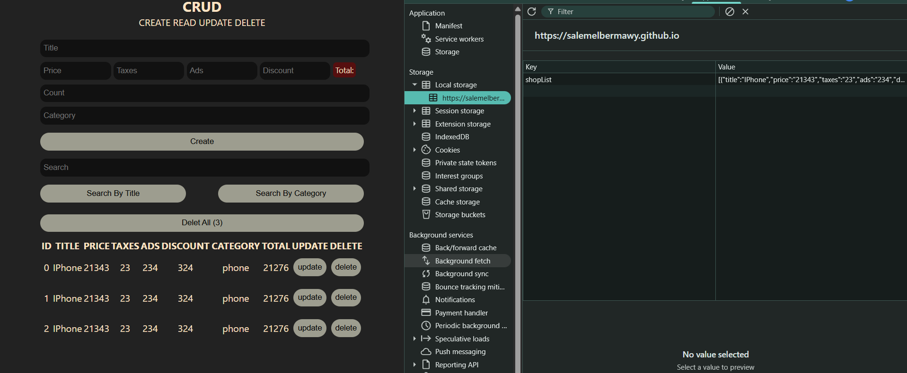
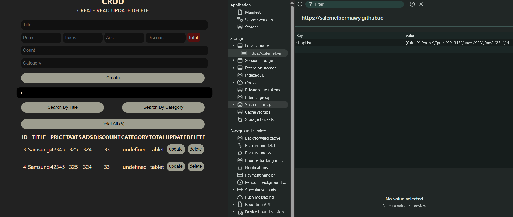
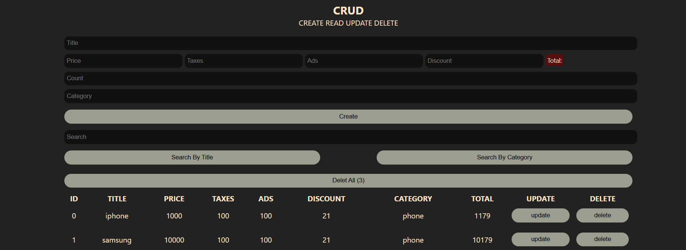
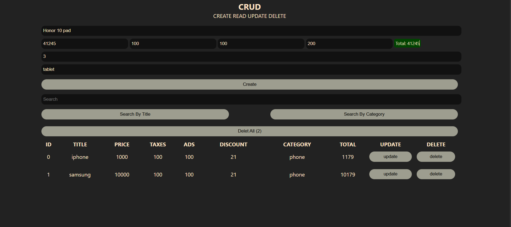
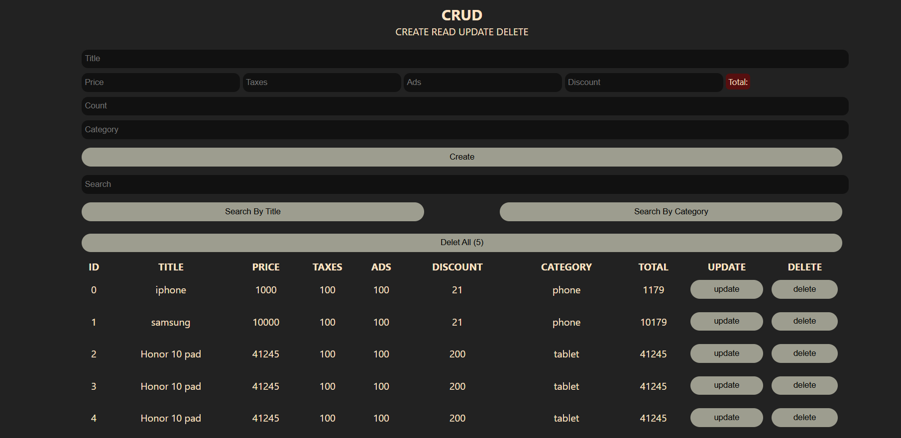
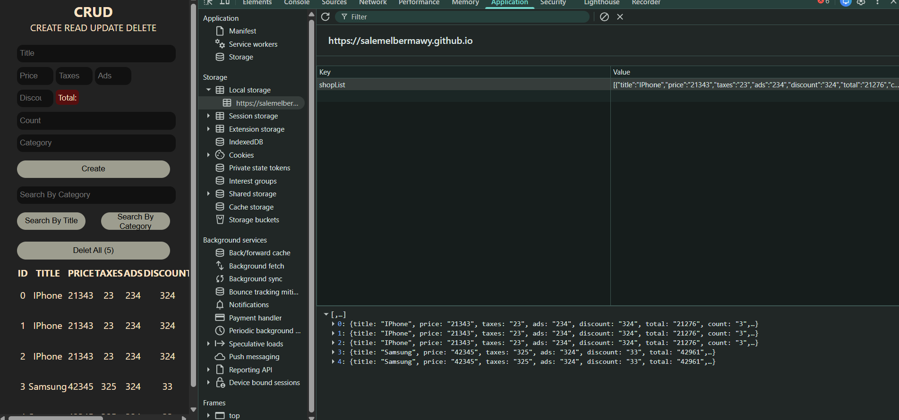

# CRUDS

- in this project you can Create Update Read Delete and Search  and there are Describtion supported by images below 
- we have local storage up to 5 mb or 10 mb so you can store many items or products in the website 
- And everything will be saved because this project is support local data storage which saved the data untill you delete it by your self

# Supported Image Describtion

- as shows in the following graph

- and here we have all 5 items but we get just two because we searched about "tablet"

- you have two feature to search according to them title and category 

- there is feature of count because if you have more than one item in the stock

- you can write the basich info about the product and write number of it

- the project is very simple to use it and is very simple and responsive

# Overview

# DataBase

